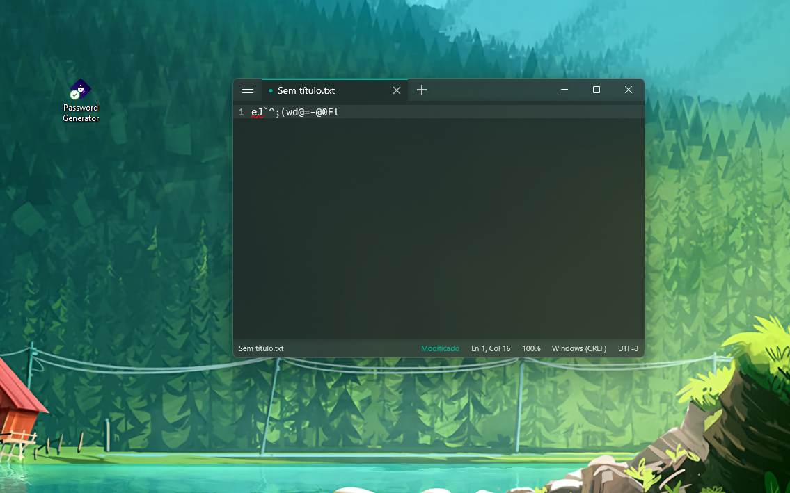
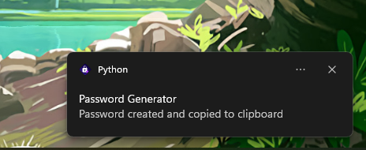

🔐 Password Generator
=========================

Made to be a quick and easy way to generate a password using just a double click. (or one).

## Features
- Secure Password
- 22 characters by default
- Fast and simple
- Auto Copy 
- Notification to confirm

Note: Notifications only available for Windows 10 devices.
 

 
 
 

## Used libraries
- [Clipboard](https://pypi.org/project/clipboard/) - Copy string to clipboard
- [Random](https://docs.python.org/3/library/random.html#functions-for-integers) - Get a random number  
- [win10toast](https://pypi.org/project/win10toast/) - Send notification to confirm